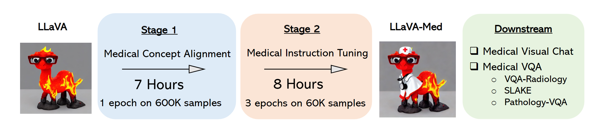
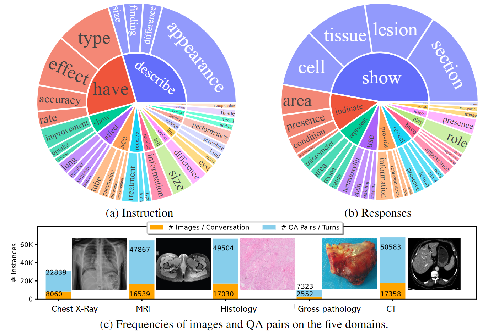

# LLaVA-Med: Large Language and Vision Assistant for BioMedicine

*Visual instruction tuning towards buiding large language and vision models with GPT-4 level capabilities in the biomedicine space.*

[[Paper](https://arxiv.org/abs/2306.00890)] 

<!-- [[Data](https://huggingface.co/datasets/liuhaotian/LLaVA-Instruct-150K)] [[Model](https://huggingface.co/liuhaotian/LLaVA-13b-delta-v0)] -->

**LLaVA-Med: Training a Large Language-and-Vision Assistant for Biomedicine in One Day** <br>

[Chunyuan Li*](https://chunyuan.li/), [Cliff Wong*](https://scholar.google.com/citations?user=Sl05ifcAAAAJ&hl=en), [Sheng Zhang*](https://scholar.google.com/citations?user=-LVEXQ8AAAAJ&hl=en), [Naoto Usuyama](https://www.microsoft.com/en-us/research/people/naotous/), [Haotian Liu](https://hliu.cc), [Jianwei Yang](https://jwyang.github.io/), [Tristan Naumann](https://scholar.google.com/citations?user=cjlSeqwAAAAJ&hl=en), [Hoifung Poon](https://scholar.google.com/citations?user=yqqmVbkAAAAJ&hl=en), [Jianfeng Gao](https://scholar.google.com/citations?user=CQ1cqKkAAAAJ&hl=en) (*Equal Contribution)

<p align="center">
     <br>
 
  *Generated by  <a href="https://gligen.github.io/">GLIGEN</a>  using the grounded inpainting mode, with three boxes: ``white doctor coat``, ``stethoscope``, ``white doctor hat with a red cross sign``.*
 
</p>

## Release

- [June 1] 🔥 We released **LLaVA-Med: Large Language and Vision Assistant for Biomedicine**, a step towards building biomedical domain large language and vision models with GPT-4 level capabilities.  Checkout the [paper](https://arxiv.org/abs/2306.00890)

<p align="center">
     <br>
 
  *LLaVA-Med was initialized with the general-domain LLaVA and then continuously trained in a curriculum learning fashion (first biomedical concept alignment then full-blown instruction-tuning). We evaluated LLaVA-Med on standard visual conversation and question answering tasks.*
</p>

[](https://github.com/tatsu-lab/stanford_alpaca/blob/main/LICENSE)
[](https://github.com/tatsu-lab/stanford_alpaca/blob/main/DATA_LICENSE)
**Usage and License Notices**: The data, code and checkpoint is intended and licensed for research use only. They are also restricted to uses that follow the license agreement of LLaMA, Vicuna and GPT-4. The dataset is CC BY NC 4.0 (allowing only non-commercial use) and models trained using the dataset should not be used outside of research purposes.


## Contents
- [Data Download](#data-download)
- [Install](#install)
- [Training](#training)
- [Serving](#serving)
- [Evaluation](#evaluation)

## Data Download

### LLaVA-Med Dataset

<p align="center">
     <br>
 
  *The data statistics of biomedical multimodal instruction-following data: (a,b) The root verb-noun pairs of instruction and responses, where the inner circle of the plot represents the root verb of the output response, and the outer circle represents the direct nouns. (c) The distribution of images and QA pairs on the five domains, one image is shown per domain.*
</p>

### Data Download
| Alignment data files | Size |
| --- | ---: |
| [llava_med_alignment_500k.json](https://hanoverprod.z21.web.core.windows.net/med_llava/alignment/llava_med_alignment_500k.json) | 341.52 MiB |

| Instruction-Tuning data files | Size |
| --- | ---: |
| [llava_med_instruct_10k.json](https://hanoverprod.z21.web.core.windows.net/med_llava/instruct/llava_med_instruct_10k.json) | 19.24 MiB |
| [llava_med_instruct_60k.json](https://hanoverprod.z21.web.core.windows.net/med_llava/instruct/llava_med_instruct_60k.json) | 	84.65 MiB |
| [llava_med_instruct_60k_inline_mention.json](https://hanoverprod.z21.web.core.windows.net/med_llava/instruct/llava_med_instruct_60k_inline_mention.json) | 83.61 MiB |
| [llava_med_instruct_fig_captions.json](https://hanoverprod.z21.web.core.windows.net/med_llava/instruct/llava_med_instruct_fig_captions.json) | 161.39 MiB |

| Evaluation files | Size |
| --- | ---: |
| [llava_med_eval_qa50_qa.jsonl](https://hanoverprod.z21.web.core.windows.net/med_llava/eval/llava_med_eval_qa50_qa.jsonl) | 	256.18 KiB |
| [llava_med_eval_qa50_fig_captions.json](https://hanoverprod.z21.web.core.windows.net/med_llava/eval/llava_med_eval_qa50_fig_captions.json) | 51.82 KiB |
| [llava_med_qa50_instruct_caption_in_text_cleaned-60k-3epoch.json](https://hanoverprod.z21.web.core.windows.net/med_llava/eval/llava_med_qa50_instruct_caption_in_text_cleaned-60k-3epoch.json) | 100.97 KiB |

| Image URLS | Size |
| --- | ---: |
| [llava_med_image_urls.jsonl](https://hanoverprod.z21.web.core.windows.net/med_llava/llava_med_image_urls.jsonl) | 122.82 MiB |

[download_images.py](llava/data/download_images.py) is used to download the PMC articles using the above image_urls file and extract the images

To download our langauge-image multimodal instruction-folllowing dataset, please run the following script:
```bash
sh download_data.sh
```

### GPT-4 Assisted Instruct Data Generation

We provide our prompts and few-shot samples for GPT-4 queries, to better facilitate research in this domain.  Please check out the [`llava/instruct/`](llava/instruct/) folder for the instruct data [generation](llava/instruct/instruct_generate.py) and [filtering](llava/instruct/instruct_postprocess.py).

To generate medical instruction tuning for 60k samples and with in-text mentions:

Fill in your OpenAI API parameters in the file [llava/openai_api.py](llava/openai_api.py):
```Shell
openai.api_type = "azure"
openai.api_key = '...'
openai.api_base = 'https://example-endpoint.openai.azure.com/'
openai.api_version = "2023-03-15-preview"
DEPLOYMENT_ID="deployment-name"
```

Generate visual instruct tuning conversations using GPT-4
```Shell
python llava/instruct/instruct_generate.py \
    --input_path data/instruct/llava_med_instruct_fig_captions.json \
    --output_path data/instruct/llava_med_instruct_60k_inline_mentions_gen.jsonl \
    --max-size 60000 \
    --use_inline_mentions True
```

Postprocessing of GPT-4 generated conversations
```Shell
python llava/instruct/instruct_postprocess.py \
    --input_path data/instruct/llava_med_instruct_60k_inline_mentions_gen.jsonl \
    --output_path data/instruct/llava_med_instruct_60k_inline_mentions_post.json
```

The file llava_med_instruct_60k_inline_mentions.json in the download is generated the same way as llava_med_instruct_60k_inline_mentions_post.json output file above.


## Install

1. Clone this repository and navigate to LLaVA-Med folder
```bash
https://github.com/microsoft/LLaVA-Med.git
cd LLaVA-Med
```

2. Install Package: Create conda environment

```Shell
conda create -n llava-med python=3.10 -y
conda activate llava-med
pip install --upgrade pip  # enable PEP 660 support
```

3. Install additional packages for training cases

```Shell
pip uninstall torch torchvision -y
pip install torch==2.0.0+cu117 torchvision==0.15.1+cu117 torchaudio==2.0.1 --index-url https://download.pytorch.org/whl/cu117
pip install openai==0.27.8
pip uninstall transformers -y
pip install git+https://github.com/huggingface/transformers@cae78c46
pip install -e .
```
```
pip install einops ninja open-clip-torch
pip install flash-attn --no-build-isolation
```


## Training


### Initialization from LLaVA-7B Weights

To ensure the smooth adaptation in terms of the multimodal chat capability, we initialize model weights from the general-domain [LLaVA](https://llava-vl.github.io/). The delta weights of LLaVA comply with the LLaMA model license. You can add the delta to the original LLaMA weights to obtain the LLaVA weights.

1. Get the original LLaMA weights in the huggingface format by following the instructions [here](https://huggingface.co/docs/transformers/main/model_doc/llama).
2. Use the following scripts to get LLaVA weights ``LLaVA-7b-v0'' by applying our delta [LLaVA-7b-delta-v0](https://huggingface.co/liuhaotian/LLaVA-7b-delta-v0)). It will automatically download delta weights from our Hugging Face account.

This conversion command needs around 30 GB of CPU RAM.
```bash
python3 -m llava.model.apply_delta \
    --base /path/to/llama-7b \
    --target /output/path/to/LLaVA-7b-v0 \
    --delta /huggingface.co/liuhaotian/LLaVA-7b-delta-v0
```

### LLaVA-Med Training
LLaVA-Med is trained on 8 A100 GPUs with 40GB memory with the following code. To train on fewer GPUs, you can reduce the `per_device_train_batch_size` and increase the `gradient_accumulation_steps` accordingly to keep the global batch size the same.

#### - Stage 1 (Optional): Medical Concept Alignment

| Hyperparameter | Global Batch Size | Learning rate | Epochs | Max length | Weight decay |
| --- | ---: | ---: | ---: | ---: | ---: |
| LLaVA-Med-7B | 128 | 2e-3 | 1 | 2048 | 0 |

<details>
<summary>Pretrain: LLaVA-Med-7B, 8x A100 (40G).  Time: ~7 hours.</summary>

```Shell
torchrun --nnodes=1 --nproc_per_node=8 --master_port=25001 \
    llava/train/train_mem.py \
    --model_name_or_path ./checkpoints/llava-7b-v0 \
    --data_path /path/to/pubmed_600k.json \
    --image_folder /path/to/pubmed_600k \
    --vision_tower openai/clip-vit-large-patch14 \
    --tune_mm_mlp_adapter True \
    --mm_vision_select_layer -2 \
    --mm_use_im_start_end \
    --bf16 True \
    --output_dir ./checkpoints/llava-med-7b-pretrain \
    --num_train_epochs 1 \
    --per_device_train_batch_size 2 \
    --per_device_eval_batch_size 4 \
    --gradient_accumulation_steps 8 \
    --evaluation_strategy "no" \
    --save_strategy "steps" \
    --save_steps 2400 \
    --save_total_limit 1 \
    --learning_rate 2e-3 \
    --weight_decay 0. \
    --warmup_ratio 0.03 \
    --lr_scheduler_type "cosine" \
    --logging_steps 1 \
    --tf32 True \
    --model_max_length 2048 \
    --gradient_checkpointing True \
    --lazy_preprocess True \
    --report_to none
```
</details>

You may run this with a single A100 GPU for the debugging purpose.  Please note that the `per_device_train_batch_size` * `gradient_accumulation_steps` can be reduced to load model checkpoint into GPU memory. But the decreased global batch size increase the total training.


#### - Stage 2: Medical Visual Instruct Tuning


| Hyperparameter | Global Batch Size | Learning rate | Epochs | Max length | Weight decay |
| --- | ---: | ---: | ---: | ---: | ---: |
| LLaVA-Med-7B | 128 | 2e-5 | 3 | 2048 | 0 |


```Shell
torchrun --nnodes=1 --nproc_per_node=8 --master_port=25001 \
    llava/train/train_mem.py \
    --model_name_or_path /path/to/llama-med-vicuna-7b \
    --data_path /path/to/llava_med_instruct_60k_inline_mention_post.jsonl \
    --image_folder /data/to/llava_med_instruct_images \
    --vision_tower openai/clip-vit-large-patch14 \
    --mm_vision_select_layer -2 \
    --mm_use_im_start_end True \
    --bf16 True \
    --output_dir /path/to/checkpoint_llava_med_instruct_60k_inline_mention \
    --num_train_epochs 3 \
    --per_device_train_batch_size 1 \
    --per_device_eval_batch_size 4 \
    --gradient_accumulation_steps 8 \
    --evaluation_strategy "no" \
    --save_strategy "steps" \
    --save_steps 5000 \
    --save_total_limit 3 \
    --learning_rate 2e-5 \
    --weight_decay 0. \
    --warmup_ratio 0.03 \
    --lr_scheduler_type "cosine" \
    --logging_steps 1 \
    --tf32 True \
    --fsdp "full_shard auto_wrap" \
    --fsdp_transformer_layer_cls_to_wrap 'LlamaDecoderLayer' \
    --model_max_length 2048 \
    --gradient_checkpointing True \
    --lazy_preprocess True \
    --report_to wandb
```

You may directly perform medical instruction tuning on [`medical instruct data`](https://hanoverprod.z21.web.core.windows.net/med_llava/instruct/llava_med_instruct_60k_inline_mention.json), by skipping Stage 1, and replacing Stage-1 checkpoint with the pretrained LLaVA checkpoint (LLaVA-7b-v0). Please see an example running script at [`run_training_llava_med.sh`](scripts/chunyl/run_training_llava_med.sh)


## Serving

| Model Checkpoints | Size |
| --- | ---: |
| [LLaVA-Med-7B (Trained on 60k instruct data with inline mentions)](https://hanoverprod.z21.web.core.windows.net/med_llava/models/finetune_e2e_on_instruct_caption_in_text_cleaned-60k-3epoch.zip) | 52.08 GiB |

### Web UI

#### Launch a controller
```Shell
python -m llava.serve.controller --host 0.0.0.0 --port 10000
```

#### Launch a model worker
```Shell
python -m llava.serve.model_worker --host 0.0.0.0 --controller http://localhost:10000 --port 40000 --worker http://localhost:40000 --model-path ./checkpoints/LLaVA-Med-7B --multi-modal
```
Wait until the process finishes loading the model and you see "Uvicorn running on ...".

#### Launch a model worker (Multiple GPUs, when GPU VRAM <= 24GB)

If your the VRAM of your GPU is less than 24GB (e.g., RTX 3090, RTX 4090, etc.), you may try running it with multiple GPUs.

```Shell
python -m llava.serve.model_worker --host 0.0.0.0 --controller http://localhost:10000 --port 40000 --worker http://localhost:40000 --model-path ./checkpoints/LLaVA-Med-7B --multi-modal --num-gpus 2
```
Wait until the process finishes loading the model and you see "Uvicorn running on ...".


#### Send a test message
```Shell
python -m llava.serve.test_message --model-name LLaVA-Med-7B --controller http://localhost:10000
```

#### Launch a gradio web server.
```Shell
python -m llava.serve.gradio_web_server --controller http://localhost:10000
```
#### You can open your browser and chat with a model now.


## Evaluation

### Medical Visual Chat (GPT-assisted Evaluation)

Our GPT-assisted evaluation pipeline for multimodal modeling is provided for a comprehensive understanding of the capabilities of vision-language models.  Please see our paper for more details.

1. Generate LLaVA-Med responses

```Shell
python model_vqa.py \
    --model-name ./checkpoints/LLaVA-7B-v0 \
    --question-file data/eval/llava_med_eval_qa50_qa.jsonl \
    --image-folder data/images/ \
    --answers-file /path/to/answer-file.jsonl
```

2. Evaluate the generated responses.  In our case, [`llava_med_eval_qa50_qa.jsonl`](/data/eval/llava_med_eval_qa50_qa.jsonl) contains the questions, context (captions and inline-mentions) and responses generated by text-only GPT-4 (0314), which we treat as ground truth.

```Shell
python llava/eval/eval_multimodal_chat_gpt_score.py \
    --question_input_path data/eval/llava_med_eval_qa50_qa.jsonl \
    --input_path /path/to/answer-file.jsonl \
    --output_path /path/to/save/gpt4-eval-for-individual-answers.jsonl
```

3. Summarize the evaluation results

```Shell
python summarize_gpt_review.py
```

### Medical VQA

Three Medical VQA datasets are considered in our experiments, including  VQA-Rad, SLAKE, Pathology-VQA. We use VQA-Rad as the running example to illustrate how LLaVA-Med is applied to a downstream scenario.

#### - Prepare Data
1. Please see VQA-Rad [repo](https://paperswithcode.com/dataset/vqa-rad) for setting up the dataset.
2. Generate VQA-Rad dataset for LLaVA-Med conversation-style format (the same format with instruct tuning). For each dataset, we process it into three components: `train.json`, `test.json`, `images`.


#### - Fine-tuning

To achieve the higher performance for given a downstream dataset, the same full-model tuning script with instruct tuning is used to continue train LLaVA-Med.

<details>
<summary> Detailed script to fine-tune to downstream datasets: LLaVA-Med-7B, 8x A100 (40G).  Time: ~1 hour.</summary>

```Shell
torchrun --nnodes=1 --nproc_per_node=8 --master_port=25001 \
    llava/train/train_mem.py \
    --model_name_or_path /path/to/checkpoint_llava_med_instruct_60k_inline_mention \
    --data_path /path/to/eval/vqa_rad/train.json \
    --image_folder /path/to/eval/vqa_rad/images \
    --vision_tower openai/clip-vit-large-patch14 \
    --mm_vision_select_layer -2 \
    --mm_use_im_start_end True \
    --bf16 True \
    --output_dir /path/to/checkpoint_llava_med_instruct_60k_inline_mention/eval/fine_tuned/vqa_rad \
    --num_train_epochs 3 \
    --per_device_train_batch_size 1 \
    --per_device_eval_batch_size 4 \
    --gradient_accumulation_steps 8 \
    --evaluation_strategy "no" \
    --save_strategy "steps" \
    --save_steps 5000 \
    --save_total_limit 3 \
    --learning_rate 2e-5 \
    --weight_decay 0. \
    --warmup_ratio 0.03 \
    --lr_scheduler_type "cosine" \
    --logging_steps 1 \
    --tf32 True \
    --fsdp "full_shard auto_wrap" \
    --fsdp_transformer_layer_cls_to_wrap 'LlamaDecoderLayer' \
    --model_max_length 2048 \
    --gradient_checkpointing True \
    --lazy_preprocess True \
    --report_to wandb
```
</details>

#### - Evaluation

Depending on which checkpoint is employed in evaluation, zero-shot performance is reported on medical instruct tuned checkpoint (eg, [LLaVA-Med-7B](/path/to/checkpoint_llava_med_instruct_60k_inline_mention)), and fine-tuned performance is reported on checkpoint that has been further tuned on training set of the downstream datasets (eg, [LLaVA-Med-7B-VQA-Rad](/path/to/checkpoint_llava_med_instruct_60k_inline_mention/fine_tuned/vqa_rad) ).

(a) Generate LLaVA responses on ScienceQA dataset

(a.1). [Option 1] Multiple-GPU inference
You may evaluate this with multiple GPUs, and concatenate the generated jsonl files.  Please refer to our script for [batch evaluation](scripts/chunyl/finetune_on_benchmarks/eval_med_dataset_batch.sh).

```Shell
python llava/eval/run_med_datasets_eval_batch.py --num-chunks 8  --model-name /path/to/checkpoint_llava_med_instruct_60k_inline_mention/eval/fine_tuned/vqa_rad \
    --question-file path/to/eval/vqa_rad/test.json \
    --image-folder path/to/eval/vqa_rad/images \
    --answers-file /path/to/checkpoint_llava_med_instruct_60k_inline_mention/eval/fine_tuned/vqa_rad/test-answer-file.jsonl
```
(a.2). [Option 2] Single-GPU inference

```Shell
python llava/eval/model_vqa_med.py --model-name /path/to/checkpoint_llava_med_instruct_60k_inline_mention/eval/fine_tuned/vqa_rad \
    --question-file path/to/eval/vqa_rad/test.json \
    --image-folder path/to/eval/vqa_rad/images \
    --answers-file /path/to/checkpoint_llava_med_instruct_60k_inline_mention/eval/fine_tuned/vqa_rad/test-answer-file.jsonl
```

(b) Evaluate the generated responses

(b.1). [Option 1] Evaluation for all three VQA datasets
```Shell

python llava/eval/run_eval_batch.py \
    --pred_file_parent_path /path/to/llava-med \
    --target_test_type test-answer-file
```

It collects the decoding results of all predictions files under the project path, computes the corresponding evaluation metrics, and outputs the results in "`eval_results_med_datasets.jsonl`". To analyze the score, we provdie ipython notebook [run_eval_metrics.ipynb](llava/notebook/run_eval_metrics.ipynb).

(b.2). [Option 2] Evaluation for on one specific VQA dataset
```Shell
python llava/eval/run_eval.py \
    --gt /path/to/eval/vqa_rad/test.json \
    --pred /path/to/checkpoint_llava_med_instruct_60k_inline_mention/eval/fine_tuned/vqa_rad/test-answer-file.jsonl
```

Please find the LLaVA-Med performance in [llava_med_performance.md](docs/llava_med_performance.md) or in the paper.

## Acknowledgement

- Our project is built upon [LLaVA](https://github.com/lm-sys/FastChat) and [Vicuna](https://github.com/lm-sys/FastChat): They provide our base models with the amazing multimodal and langauge capabilities, respectively!

If you find LLaVA-Med useful for your your research and applications, please cite using this BibTeX:
```bibtex
@article{li2023llavamed,
  title={Llava-med: Training a large language-and-vision assistant for biomedicine in one day},
  author={Li, Chunyuan and Wong, Cliff and Zhang, Sheng and Usuyama, Naoto and Liu, Haotian and Yang, Jianwei and Naumann, Tristan and Poon, Hoifung and Gao, Jianfeng},
  journal={arXiv preprint arXiv:2306.00890},
  year={2023}
}
```


## Related Projects

- [LLaVA](https://llava-vl.github.io/)
- [BioMed CLIP](https://huggingface.co/microsoft/BiomedCLIP-PubMedBERT_256-vit_base_patch16_224)
- [Instruction Tuning with GPT-4](https://github.com/Instruction-Tuning-with-GPT-4/GPT-4-LLM)


