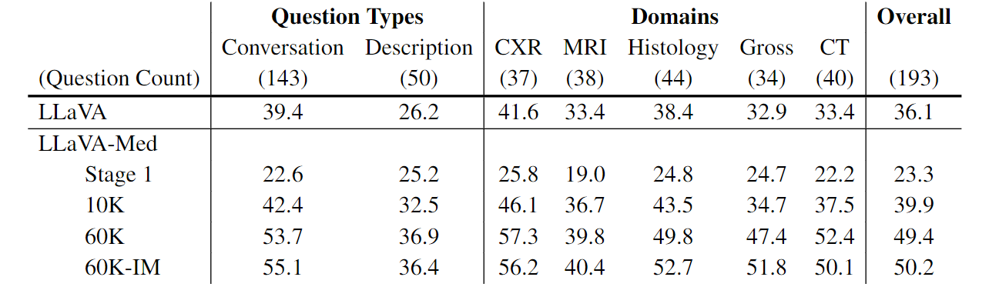

# LLaVA-Med: Large Language and Vision Assistant for BioMedicine

*Visual instruction tuning towards buiding large language and vision models with GPT-4 level capabilities in the biomedicine space.*

[[Paper](https://arxiv.org)] 

<!-- [[Data](https://huggingface.co/datasets/liuhaotian/LLaVA-Instruct-150K)] [[Model](https://huggingface.co/liuhaotian/LLaVA-13b-delta-v0)] -->

**LLaVA-Med: Training a Large Language-and-Vision Assistant for Biomedicine in One Day**  

[Chunyuan Li*](https://chunyuan.li/), [Cliff Wong*](https://scholar.google.com/citations?user=Sl05ifcAAAAJ&hl=en), [Sheng Zhang*](https://scholar.google.com/citations?user=-LVEXQ8AAAAJ&hl=en), [Naoto Usuyama](https://www.microsoft.com/en-us/research/people/naotous/), [Haotian Liu](https://hliu.cc), [Jianwei Yang](https://jwyang.github.io/), [Tristan Naumann](https://scholar.google.com/citations?user=cjlSeqwAAAAJ&hl=en), [Hoifung Poon](https://scholar.google.com/citations?user=yqqmVbkAAAAJ&hl=en), [Jianfeng Gao](https://scholar.google.com/citations?user=CQ1cqKkAAAAJ&hl=en) (*Equal Contribution)

      
 
  *Generated by  <a href="https://gligen.github.io/">GLIGEN</a>  using the grounded inpainting mode, with three boxes: ``white doctor coat``, ``stethoscope``, ``white doctor hat with a red cross sign``.*
 

## Release

- [June 1] 🔥 We released **LLaVA-Med: Large Language and Vision Assistant for Biomedicine**, a step towards building biomedical domain large language and vision models with GPT-4 level capabilities.  Checkout the [paper](https://arxiv.org/abs/2304.08485)

      
 
  *LLaVA-Med was initialized with the general-domain LLaVA and then continuously trained in a curriculum learning fashion (first biomedical concept alignment then full-blown instruction-tuning). We evaluated LLaVA-Med on standard visual conversation and question answering tasks.*

## LLaVA-Med Dataset

      
 
  *The data statistics of biomedical multimodal instruction-following data: (a,b) The root verb-noun pairs of instruction and responses, where the inner circle of the plot represents the root verb of the output response, and the outer circle represents the direct nouns. (c) The distribution of images and QA pairs on the five domains, one image is shown per domain.*

## LLaVA-Med Performance

      
 
  *Performance comparison of mulitmodal chat instruction-following abilities, measured by the relative score via language GPT-4 evaluation.*

      
 
  *Example 1: comparison of medical visual chat. The language-only GPT-4 is considered as the performance upper bound, as the golden captions and inline mentions are fed into GPT-4 as the context, without requiring the model to understand the raw image.*

      
 
  *Example 2: comparison of medical visual chat. LLaVA tends to halluciate or refuse to provide domain-specific knowledgable response.*

      
 
  *Performance comparison of fine-tuned LLaVA-Med on established Medical QVA datasets.*

## Related Projects

- [LLaVA](https://llava-vl.github.io/)
- [BioMed CLIP](https://huggingface.co/microsoft/BiomedCLIP-PubMedBERT_256-vit_base_patch16_224)
- [Instruction Tuning with GPT-4](https://github.com/Instruction-Tuning-with-GPT-4/GPT-4-LLM)

**Usage and License Notices**: The data, code and checkpoint is intended and licensed for research use only. They are also restricted to uses that follow the license agreement of LLaMA, Vicuna and GPT-4. The dataset is CC BY NC 4.0 (allowing only non-commercial use) and models trained using the dataset should not be used outside of research purposes.

