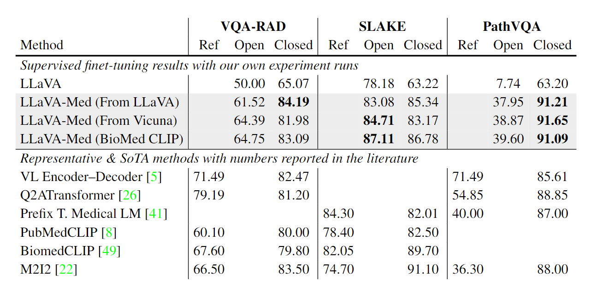

## LLaVA-Med-1.5 Performance

      
 
  *Performance comparison of mulitmodal chat instruction-following abilities, measured by the relative score via language GPT-4 evaluation.*

## LLaVA-Med-1.0 Performance

      
 
  *Example 1: comparison of medical visual chat. The language-only GPT-4 is considered as the performance upper bound, as the golden captions and inline mentions are fed into GPT-4 as the context, without requiring the model to understand the raw image.*

      
 
  *Example 2: comparison of medical visual chat. LLaVA tends to halluciate or refuse to provide domain-specific knowledgable response.*

      
 
  *Performance comparison of fine-tuned LLaVA-Med on established Medical QVA datasets.*

